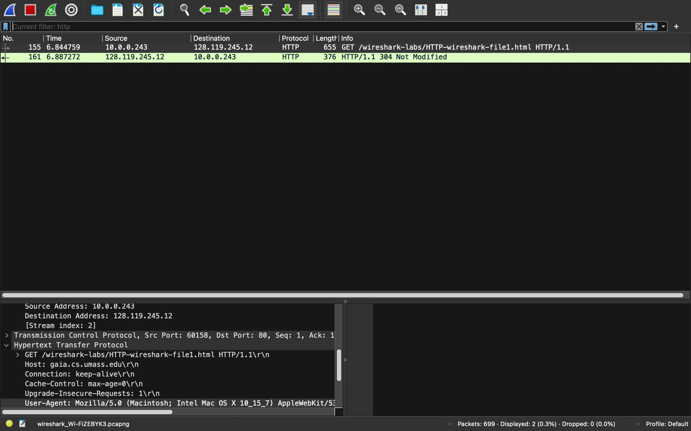
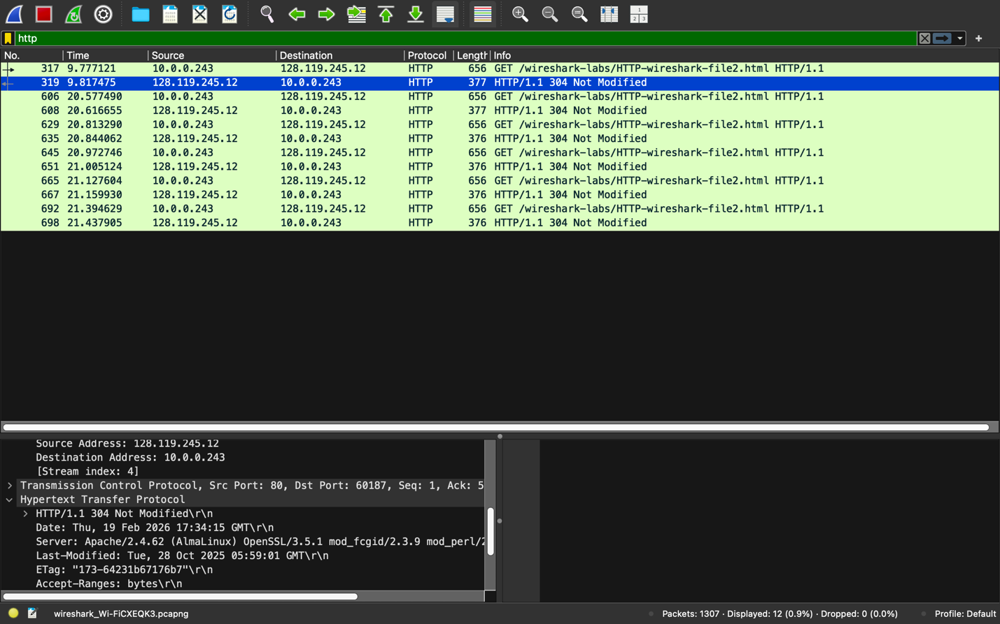
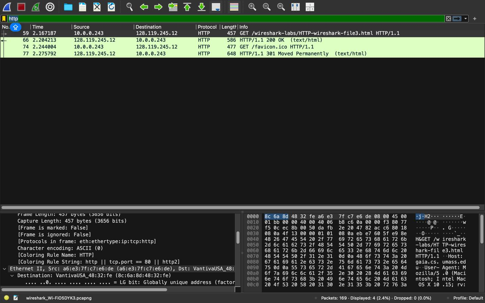
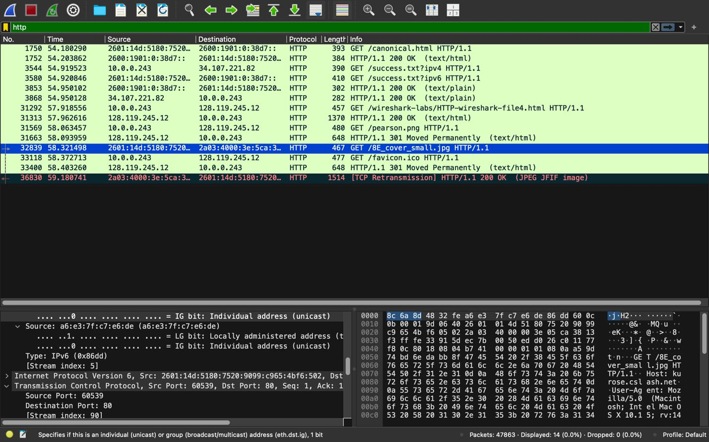
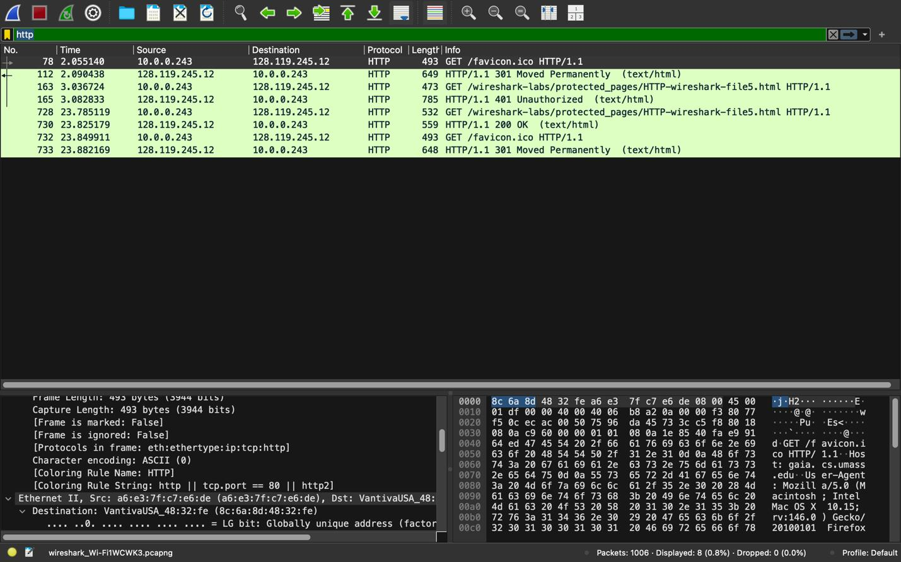

# Wireshark HTTP Protocol Analysis

A hands-on packet-capture investigation of HTTP/1.1 behavior — basic request/response, conditional GETs, large payload fragmentation, embedded object retrieval, and HTTP Basic Authentication — using Wireshark and Google Chrome.

**Tools used:** Wireshark, Google Chrome, TCP/IP packet inspection

---

## Overview

This lab captures and analyzes live HTTP traffic between a browser and `gaia.cs.umass.edu` to answer concrete questions about how HTTP actually behaves on the wire: protocol versioning, caching (conditional GET), TCP segmentation of large responses, parallel vs. serial object retrieval, and how credentials are transmitted after a 401 challenge.

Each section below documents the methodology, the captured evidence, and the conclusion drawn from it.

---

## 1. Basic HTTP GET/Response

**Goal:** Capture a single HTTP GET and its response, and inspect the raw protocol details.

**Method:** Filtered Wireshark to `http`, requested a minimal one-line HTML file, and inspected the GET/200 OK pair.

**Findings:**
- Browser HTTP version: **HTTP/1.1**
- Client IP: `10.0.0.243`
- Server IP (`gaia.cs.umass.edu`): `128.119.245.12`

---

## 2. Conditional GET / Caching

**Goal:** Observe how a browser avoids re-downloading unchanged content.

**Method:** Loaded a page with a hard refresh (`Ctrl+F5`, bypassing cache) followed immediately by a normal refresh, then compared the resulting request/response pairs.

**Finding:** Subsequent requests returned **`304 Not Modified`** rather than a full `200 OK` payload — confirming the browser issued a conditional GET (using `If-Modified-Since` / `ETag`) and the server correctly declined to resend unchanged content.

---

## 3. Large Response Fragmentation

**Goal:** Understand how HTTP responses that exceed a single TCP segment are transmitted.

**Method:** Retrieved a ~4500-byte HTML file, too large for one TCP segment, and inspected how Wireshark reassembled the response.

**Findings:**
- **2 HTTP GET requests** were sent (the page itself, plus one for `favicon.ico`)
- The main response was split across multiple TCP segments, reassembled by Wireshark into a single PDU (`TCP segment of a reassembled PDU`), demonstrating that a single HTTP message can span several underlying TCP packets.

---

## 4. Embedded Objects (Multi-Host Retrieval)

**Goal:** Determine whether a browser fetches embedded objects (images referenced from two different servers) serially or in parallel.

**Method:** Loaded an HTML page with two images hosted on two different `cs.umass.edu` subdomains, then compared request timestamps.

**Finding:** The image requests were sent with **distinct timestamps rather than concurrently**, indicating **serial (sequential) transmission** rather than parallel retrieval for this capture.

---

## 5. HTTP Authentication

**Goal:** Observe the HTTP Basic Authentication handshake against a password-protected resource.

**Method:** Requested a protected page with a cleared cache, supplied credentials at the browser prompt, and compared the first and second GET requests.

**Finding:** The first request received a **`401 Unauthorized`** challenge. The browser then resent the GET with a new **`Authorization`** header containing the encoded credentials, which the server accepted (`200 OK`) — the standard HTTP Basic Auth challenge/response flow.

---

## Key Takeaways

- HTTP/1.1's conditional GET mechanism (`ETag`/`Last-Modified`) meaningfully reduces redundant data transfer.
- A single HTTP response is not guaranteed to fit in one TCP segment — reassembly happens transparently below the application layer.
- Multi-object pages can incur real latency costs depending on whether requests are pipelined/parallelized or issued serially.
- HTTP Basic Authentication is stateless per-request: credentials are re-sent (base64-encoded, not encrypted) on every subsequent request via the `Authorization` header.

---

*Based on the Wireshark Introductory Lab methodology (Kurose & Ross, Computer Networks: A Top-Down Approach).*
