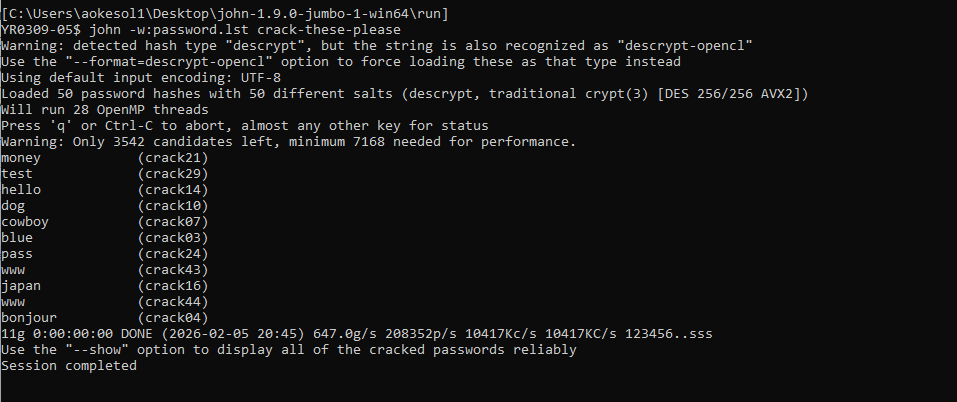
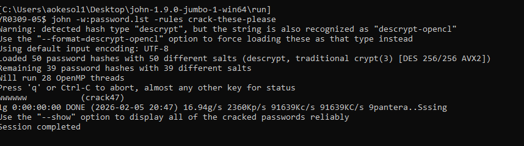
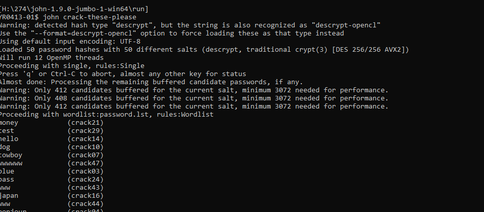

# Password Cracking with John the Ripper

A hands-on offensive-security lab cracking 50 UNIX password hashes using John the Ripper's dictionary, hybrid, and combination attack modes — followed by a quantitative analysis of password strength against brute-force attacks, accounting for Moore's Law.

## Skills Demonstrated
- Offline password-hash cracking using John the Ripper (dictionary, hybrid, and combination/brute-force modes)
- Interpreting cracked-password output and session logs (`john.pot`) to evaluate attack effectiveness
- Recognizing UNIX password hash formats (`descrypt` / traditional DES crypt(3))
- Quantitative password-strength modeling using a brute-force time-to-crack estimator
- Projecting future attack feasibility using Moore's Law scaling
- Drawing practical password-policy conclusions from empirical cracking results

## Tools & Technologies
`John the Ripper` · `Windows Command Line` · `UNIX password hashing (crypt/DES)` · `Excel (Brute Force Attack Estimator)`

## Topics Covered
Dictionary attacks · Hybrid/rule-based attacks · Combination (brute-force) attacks · Password entropy · Moore's Law and future-proofing password policy

---

## Overview

Starting from a file of 50 UNIX password hashes (`crack-these-please`), this lab runs three escalating attack strategies against the same hash set to measure how much each technique contributes, then uses a brute-force estimator spreadsheet to reason about how long password policies will remain secure as computing power grows.

---

## 1. Dictionary Attack

**Goal:** Test how many passwords are crackable using only a ~3,000-word dictionary (`password.lst`).

**Command:**
```
john -w:password.lst crack-these-please
```

**Result:** **11 of 50 passwords** cracked in under a second — all short, common words (`money`, `test`, `hello`, `dog`, `cowboy`, `blue`, `pass`, `www`, `japan`, `bonjour`).



**Takeaway:** Any password that is a plain dictionary word — regardless of length — offers effectively no protection against an offline attacker with a basic wordlist.

---

## 2. Hybrid Attack

**Goal:** Test whether applying rule-based mutations (character substitution, appending digits, case changes, etc.) to the same dictionary catches additional passwords.

**Command:**
```
john -w:password.lst -rules crack-these-please
```

**Result:** **21 of 50 passwords** cracked total — **10 more** than the dictionary-only pass. The newly cracked passwords were variations of dictionary words (e.g. `wwwww`), confirming that `-rules` mutates each wordlist entry (repetition, capitalization, digit-appending, etc.) rather than introducing new vocabulary.



**Takeaway:** Predictable "leetspeak" or pattern-based tweaks to a common word (`password1`, `Password!`) provide only marginal protection — rule-based cracking anticipates exactly this behavior.

---

## 3. Combination Attack

**Goal:** Let John run its full default strategy — single-mode, wordlist+rules, and incremental brute-force — to see how many additional (non-dictionary-derived) passwords fall.

**Command:**
```
john crack-these-please
```

**Result:** After ~3 minutes, **39 of 50 passwords** cracked total (**18 more** than the hybrid pass). The remaining **11 passwords were never cracked** in the time allotted. The passwords cracked in this final phase were visibly more complex than earlier ones, consistent with brute-force taking longer to reach less-predictable candidates.



**Summary of results:**

| Phase | Passwords Cracked | Cumulative Total |
|---|---|---|
| Dictionary attack | 11 | 11 |
| Hybrid attack | +10 | 21 |
| Combination attack | +18 | 39 |
| Never cracked | — | 11 remaining |

---

## 4. Password Strength Estimation (Brute-Force Modeling)

Using the Mandylion "Brute Force Attack Estimator" spreadsheet, I modeled how password length and character set affect resistance to brute-force attacks, adjusting for hardware improvements over time.

| Scenario | Result |
|---|---|
| Numbers-only password resisting 100 years (spreadsheet baseline) | **17 characters** |
| Same, adjusted for Moore's Law to *today's* hardware (4x factor) | **18 characters** |
| Same, projected 50 years forward (~2.5M× factor) | **24 characters** |
| Mixed alpha/numeric/special password, 50-years-forward hardware | **10 characters** |

**Takeaway:** Character-set diversity is a far more efficient lever than length alone — a 10-character fully-random mixed-character password matches the resistance of a 24-character numbers-only password against hardware 50 years from now. Password policies that only enforce length, without enforcing complexity, are significantly under-protecting users against long-term brute-force risk.

---

## Key Takeaways

- Roughly **1 in 5 passwords** in a real-world-style set fell to a plain dictionary attack alone — the cheapest, fastest attack available.
- Rule-based mutation (hybrid attack) nearly doubled the crack rate over dictionary-only, showing that simple word variations are not a meaningful defense.
- Even with brute-force applied, **22% of passwords (11/50) survived** within the test window — these were the longer, higher-entropy passwords, demonstrating that entropy (not obscurity) is what actually resists cracking.
- Character-set diversity reduces required password length dramatically compared to numeric-only passwords, and this gap widens as attacker hardware improves — password policy needs to account for compute growth (Moore's Law), not just today's threat model.

---

*Lab performed using John the Ripper 1.9.0-jumbo-1 (Windows build) against a UNIX-style DES crypt(3) hash set.*
