# Network Reconnaissance with Nmap & tcpdump

A hands-on offensive-security lab performing host discovery, port scanning, OS fingerprinting, and live traffic capture against a target VM — simulating the reconnaissance phase an attacker performs before attempting exploitation, using Kali Linux.

## Skills Demonstrated
- Host discovery and port scanning with Nmap (ping sweep, TCP connect, SYN/stealth, and aggressive scans)
- Interpreting scan-technique tradeoffs (e.g. `-sT` completing the TCP handshake vs. `-sS` stealth half-open scanning to reduce IDS detection)
- OS and service fingerprinting from scan output
- Live packet capture and traffic analysis with tcpdump across interfaces
- Reading raw ARP/DNS traffic to identify active hosts on a network segment
- Saving and replaying packet captures for offline analysis
- Building a partial network layout from a single compromised/known host — the reconnaissance step of the intrusion kill chain

## Tools & Technologies
`Nmap` · `tcpdump` · `Kali Linux` · `VMware Workstation Pro` · `TCP/IP`

## Topics Covered
Host discovery (ICMP/ARP) · TCP connect vs. SYN scanning · Port/service enumeration · OS fingerprinting · IDS evasion considerations · Live traffic capture · ARP/DNS traffic analysis · Packet capture persistence (`-w`/`-r`)

---

## Overview

Working from two Kali Linux VMs on the same network, this lab simulates the initial reconnaissance an attacker performs against a target: first mapping what's alive on the network and what services it exposes (Nmap), then passively capturing live traffic to identify additional hosts and devices communicating on the segment (tcpdump). Together, these represent the first step of the intrusion kill chain — reconnaissance — which is also exactly what a defender needs to understand in order to reduce their own exposed attack surface.

**Target:** `192.168.157.139` (second Kali VM on the same virtual network)

---

## Part 1: Host & Port Discovery with Nmap

### Ping sweep — is the host alive?
```
sudo nmap -sP 192.168.157.139
```
Confirms the host is up and returns its MAC address — the most basic reconnaissance step before investing time in deeper scanning.

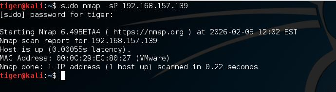

### TCP Connect scan on specific ports
```
sudo nmap -sT -p 80,443 192.168.157.139
```
Checks specifically whether web (80) and HTTPS (443) services are exposed. Both showed **closed** on this target.

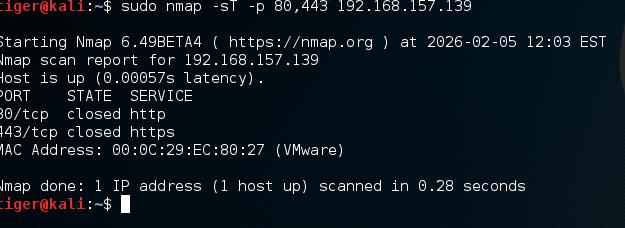

### SYN (stealth) scan on specific ports
```
sudo nmap -sS -p 80,443 192.168.157.139
```
Same target ports, different technique: `-sS` sends only SYN and reads the SYN/ACK response without completing the handshake (no final ACK). This makes the scan less likely to be logged by connection-based IDS/logging compared to `-sT`, which completes a full TCP handshake.

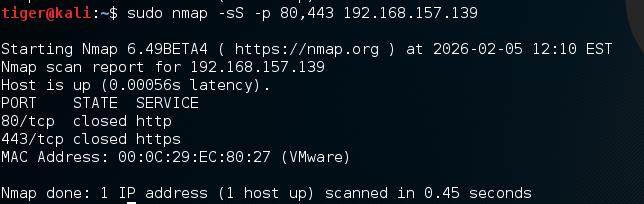

### Full TCP connect scan, default port range
```
sudo nmap -sT 192.168.157.139
```
No ports specified, so Nmap scans its default top 1000 ports. All 1000 came back closed on this target.

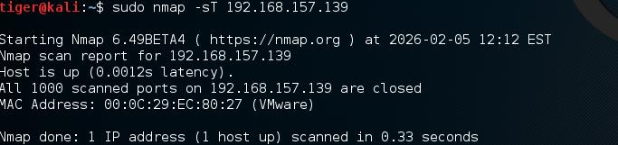

### OS fingerprinting
```
sudo nmap -O 192.168.157.139
```
Attempts to identify the target's operating system from TCP/IP stack behavior. Returned a Linux 2.4.x/2.6.x kernel fingerprint (flagged as potentially unreliable since no open/closed port pair was available to fingerprint against).

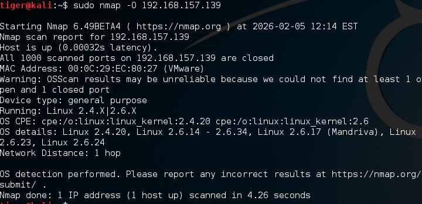

### Aggressive scan
```
sudo nmap -A 192.168.157.139
```
Combines OS detection, version detection, script scanning, and traceroute in one pass — the most information-dense (and most detectable) scan used in this lab.

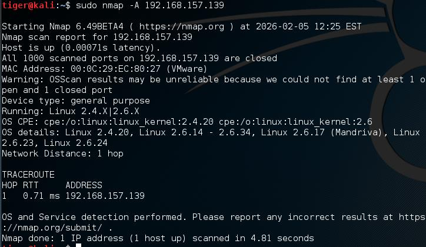

### Host discovery only (no port scan)
```
sudo nmap -sn 192.168.157.139
```
Confirms liveness without touching any ports — useful for quietly mapping which hosts exist on a subnet before scanning any of them.

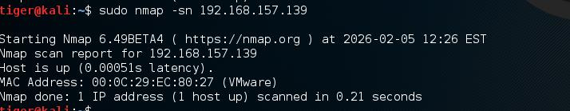

### Port scan only (skip host discovery)
```
sudo nmap -Pn 192.168.157.139
```
Assumes the host is up and scans ports directly — useful against targets that block ICMP/ping but still respond on TCP.

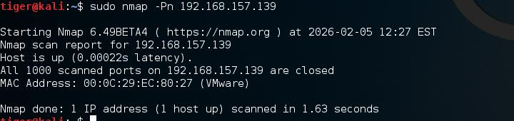

### ARP-based discovery
```
sudo nmap -PR 192.168.157.139
```
Uses ARP requests instead of ICMP for host discovery — effective and low-noise on a local (same-subnet) network.

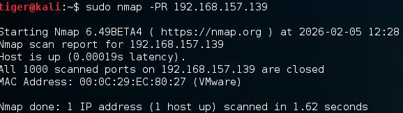

### Scan without DNS resolution
```
sudo nmap -n 192.168.157.139
```
Skips reverse-DNS lookups entirely, speeding up the scan and avoiding DNS-server-side logging of the reconnaissance activity.

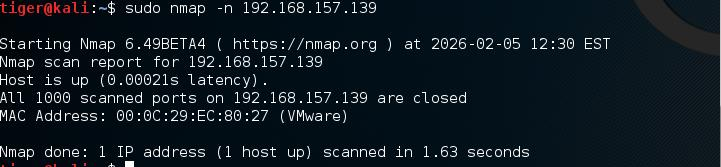

---

## Part 2: Live Traffic Capture with tcpdump

While Nmap actively probes a target, tcpdump takes the opposite approach: passively listening to traffic already crossing the wire to build a picture of what's talking to what — without sending a single probe of its own.

### Capture from all interfaces
```
sudo tcpdump -i any
```
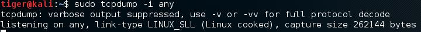

### Capture from a specific interface
```
sudo tcpdump -i eth0
```
Live capture reveals ARP requests and DNS (PTR) lookup traffic between hosts on the segment — each packet exposing the IP (and, unmasked, MAC) address of an active device.

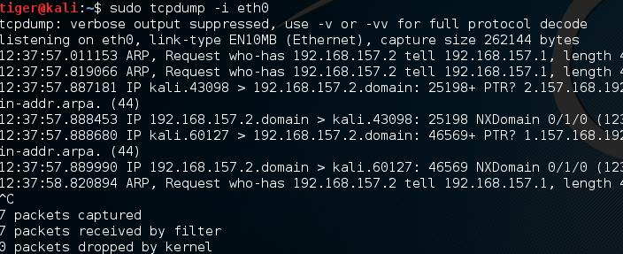

### Capture a fixed number of packets
```
sudo tcpdump -i eth0 -c 10
```
Captures exactly 10 packets and exits automatically — useful for quick, bounded samples instead of an open-ended capture.

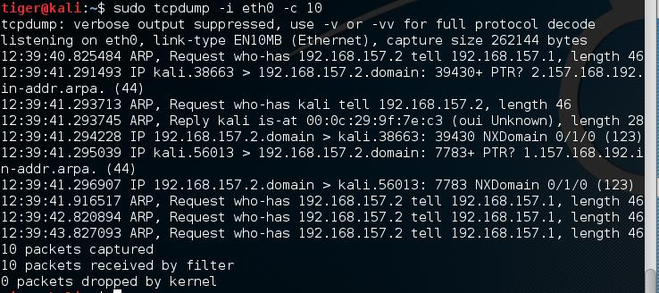

### List available capture interfaces
```
sudo tcpdump -D
```
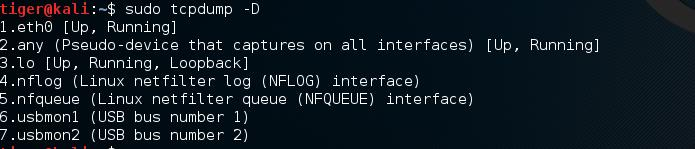

### Print packet contents in ASCII
```
sudo tcpdump -i eth0 -A
```
Renders payload bytes as readable ASCII alongside the packet headers — useful for spotting cleartext protocol data.

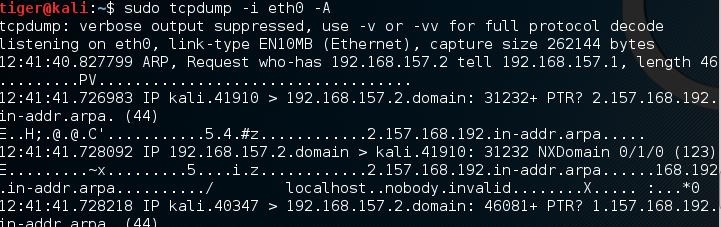

### Save a capture to disk
```
sudo tcpdump -i eth0 -w tcpdump.txt
```
Persists the raw capture to a file for later, repeatable analysis instead of losing it once the terminal scrolls past.

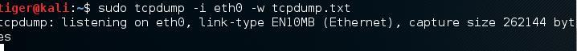

### Replay a saved capture
```
sudo tcpdump -r tcpdump.txt
```
Reads back the saved file exactly as if it were live — confirming the capture was recorded correctly and can be revisited offline.

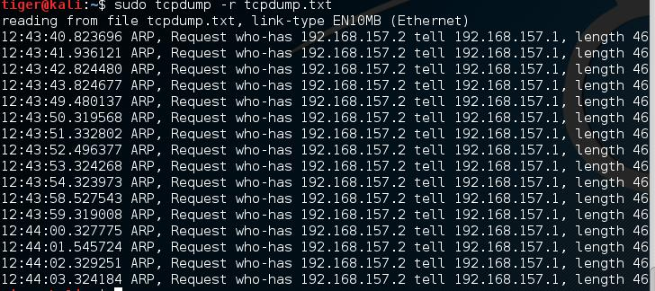

### List supported data-link types
```
sudo tcpdump -L
```


---

## Key Takeaways

- **Scan technique matters, not just the target.** `-sT` and `-sS` return the same result (open/closed ports) but leave very different footprints — `-sT` completes full TCP handshakes that are easy to log, while `-sS` never completes the handshake and is meaningfully quieter against connection-logging defenses.
- **Reconnaissance can be entirely passive.** Nmap actively probes a target and can be detected; tcpdump requires sending nothing at all — it simply listens. A well-instrumented network should be watching for both.
- **A single compromised host is enough to start mapping a network.** Combining host discovery, port/service enumeration, and passive traffic capture from one machine builds a meaningful picture of a network's live hosts and running services without any prior documentation.
- **Defenders should assume both approaches are in use against them.** Disabling ICMP responses stops naive ping sweeps but not ARP-based (`-PR`) or SYN-based reconnaissance, and IDS tuned only for completed TCP connections will miss SYN-scan activity entirely.

---

*Lab performed in an isolated Kali Linux VMware environment (two Kali VMs on a shared virtual network) — Towson University ITEC 457.*
