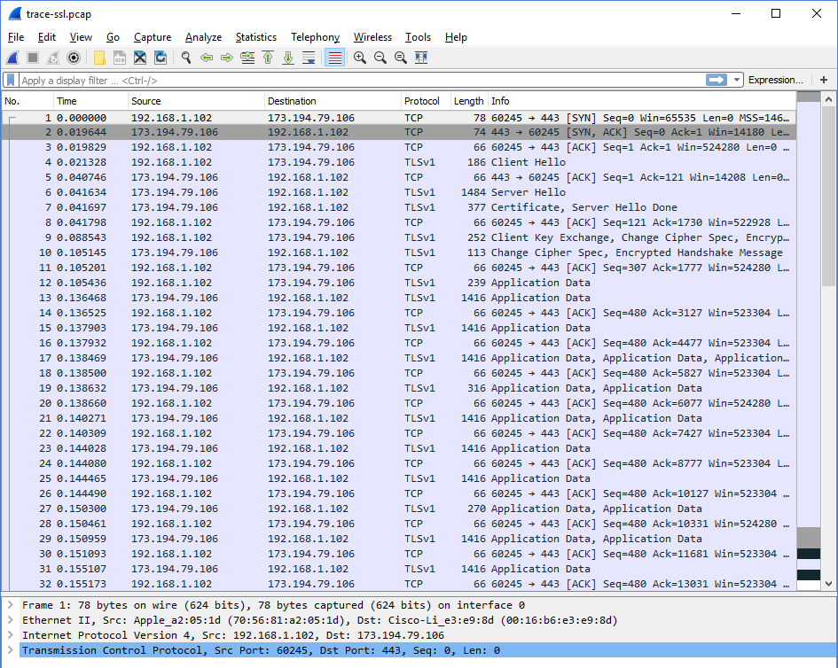
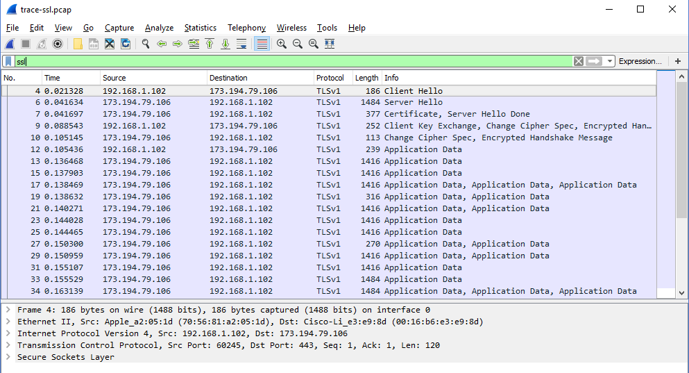
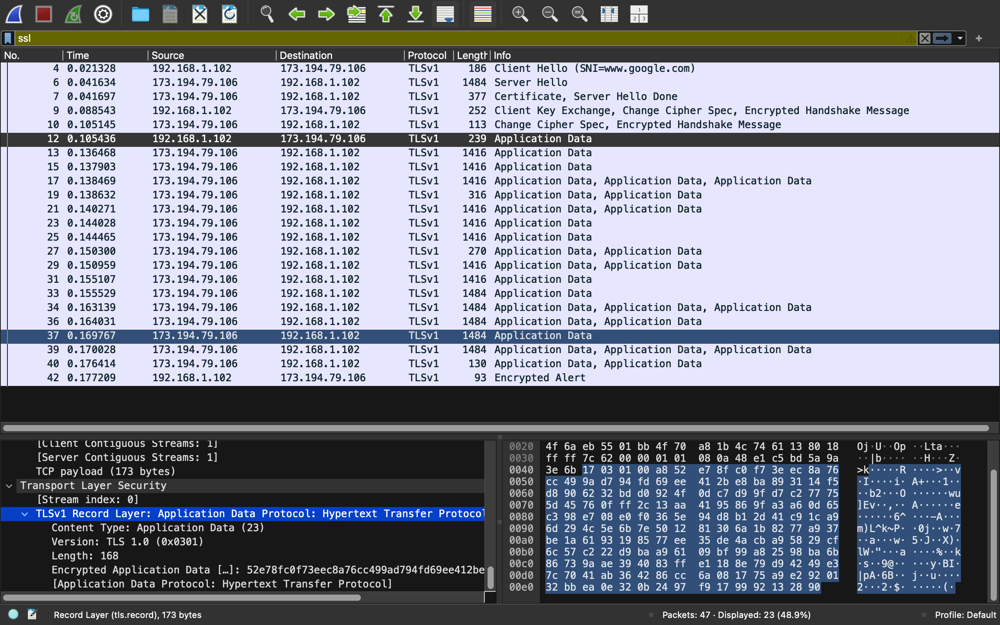
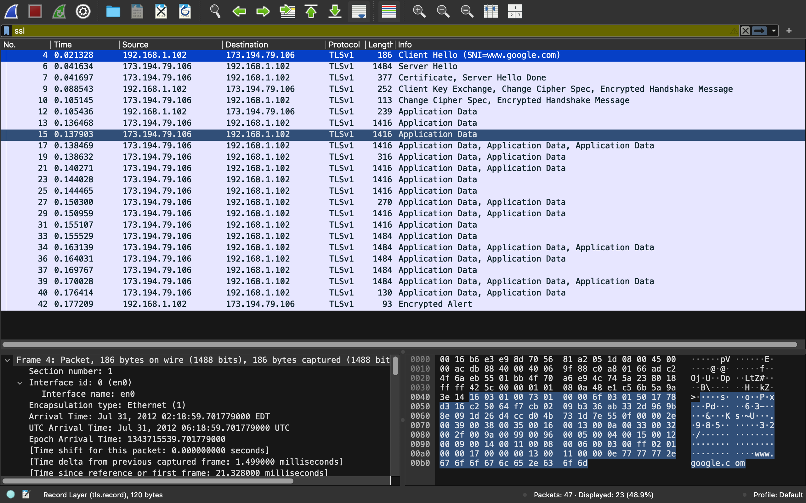
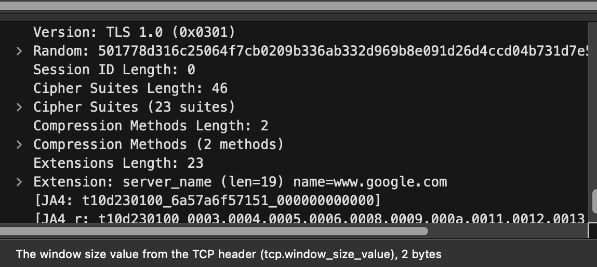
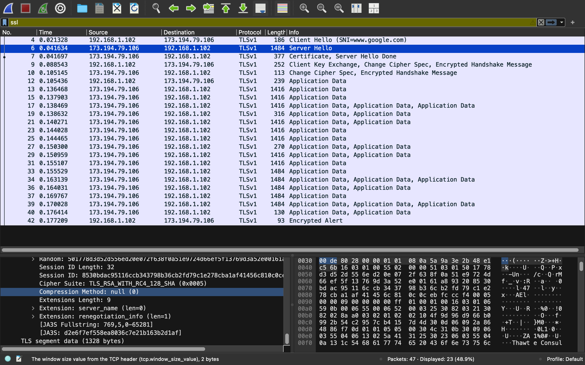
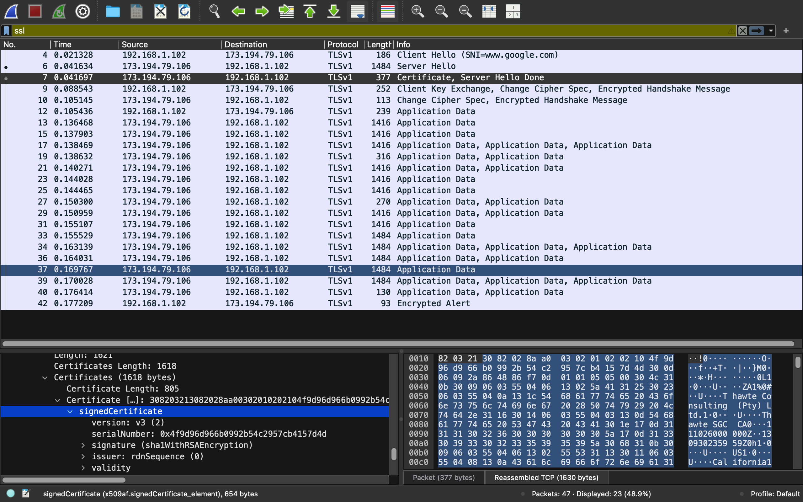
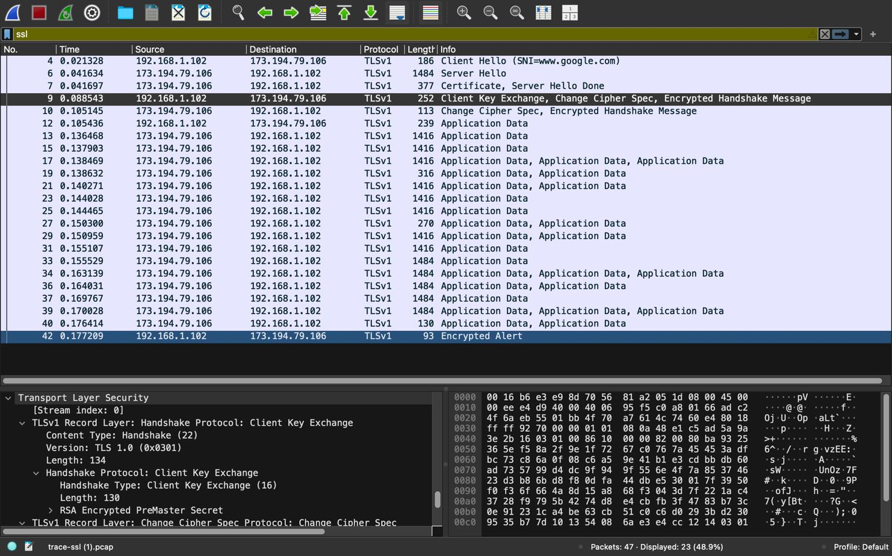
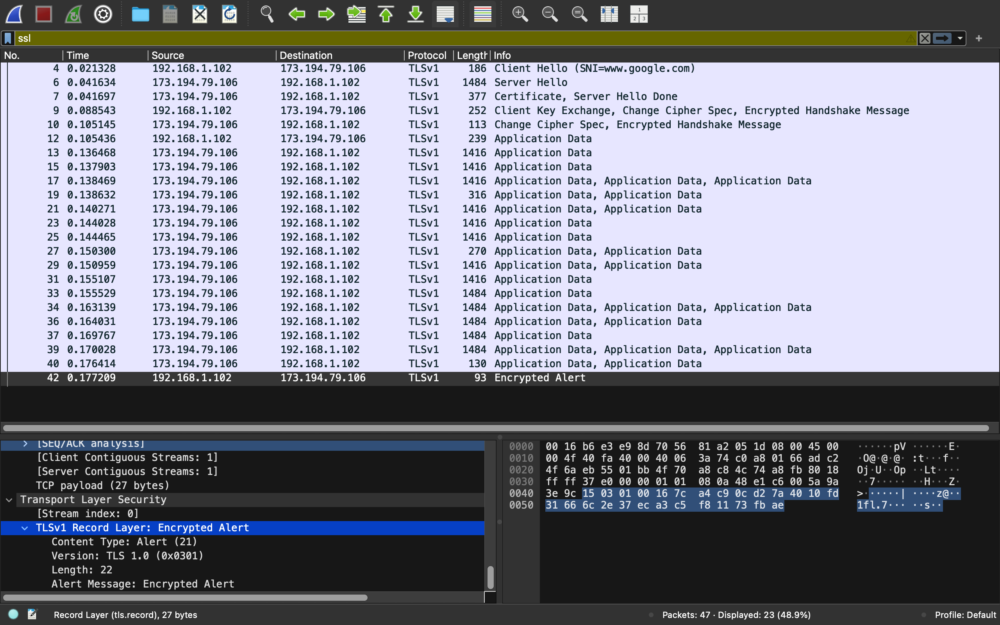

# SSL/TLS Protocol Analysis

A packet-level walkthrough of a full TLS handshake and encrypted session — using Wireshark to inspect a captured HTTPS connection from initial Client Hello through encrypted Application Data to connection teardown.

## Skills Demonstrated
- Reading and interpreting a complete TLS handshake at the packet level
- Distinguishing TLS record types (Handshake, Change Cipher Spec, Application Data, Alert) by Content Type
- Identifying cipher suite negotiation and understanding its security implications
- Recognizing certificate-based server authentication in a live capture
- Understanding why TLS compression is disabled by default (CRIME attack mitigation)
- Explaining the practical difference between plaintext handshake metadata and encrypted application data

## Tools & Technologies
`Wireshark` · `TLS/SSL` · `X.509 Certificates` · `TCP/IP`

## Topics Covered
TLS handshake sequence · Cipher suite negotiation · Server authentication via certificates · TLS record Content Types (Handshake, Change Cipher Spec, Application Data, Alert) · Session resumption (Session ID) · CRIME attack mitigation (compression) · Connection teardown (Alert / close_notify)

---

## Overview

HTTPS is HTTP layered over TLS, and its entire security value proposition — authentication of the server, and confidentiality/integrity of the exchanged data — comes from the TLS handshake that precedes any application data. This lab dissects a captured HTTPS session to `www.google.com` packet-by-packet, tracing the handshake from the first plaintext Hello through certificate exchange, key negotiation, the switch to encryption, and finally the encrypted connection teardown.

**Trace analyzed:** `trace-ssl.pcap` — a captured TLS 1.0 session between a client (`192.168.1.102`) and Google (`173.194.79.106`).

---

## 1. The Full Trace

Before filtering, the raw capture shows the underlying TCP mechanics (SYN/ACK handshake) surrounding the TLS session — a reminder that TLS runs *on top of* an already-established TCP connection, not in place of one.

Applying a `ssl` display filter isolates just the TLS/SSL messages, removing TCP-layer noise (ACKs, connection open/close) and making the handshake sequence easy to follow.

---

## 2. Inspecting an Application Data Record

**Packet #12** — a mid-session `Application Data` message — shows what a TLS record looks like *after* the handshake completes and encryption is active:

| Field | Value | Meaning |
|---|---|---|
| Content Type | `23` (Application Data) | Identifies this as encrypted HTTP payload, not a handshake or alert message |
| Version | TLS 1.0 (`0x0301`) | The negotiated protocol version used to encrypt this record |
| Length | 168 bytes | Size of the encrypted payload that follows |
| Encrypted Application Data | (ciphertext) | The actual encrypted HTTP traffic — unreadable without the session key |

**Takeaway:** Once the handshake completes, every subsequent record's payload is opaque ciphertext — Wireshark (or any on-path observer) can see *that* data is being exchanged and roughly how much, but not its contents.

---

## 3. The TLS Handshake

A full handshake for a new connection proceeds through six phases:

1. Client and Server exchange **Hello** messages
2. Server sends its **Certificate** (and optionally requests one from the client)
3. Client sends **key exchange** material and signals a switch to encryption
4. Server signals its own switch to encryption
5. Both sides send **encrypted Application Data**
6. An **Alert** signals connection closure

### Client Hello (packet #4)

The Client Hello is sent in the clear (no encryption is established yet), and contains the connection parameters the client is proposing:

Key fields inspected:
- **Cipher Suites Length:** 46 bytes (23 offered cipher suites, ordered by client preference)
- **Compression Method Length:** 2 (methods offered — but secure clients advertise `null` compression only, to avoid the **CRIME attack**, which exploits compression to leak encrypted data)
- **Server Name extension:** `www.google.com` — this is the SNI (Server Name Indication) field, which lets a single IP host multiple HTTPS sites by telling the server which certificate to present

### Server Hello (packet #6)

The server responds with its chosen parameters — a real negotiation, not just an echo:

- **Session ID:** 32 bytes (would allow an abbreviated handshake on session resumption — unused here since the client had no prior session to resume)
- **Cipher Suite:** `TLS_RSA_WITH_RC4_128_SHA` — the server's selected cipher from the client's offered list
- **Compression Method:** `null` — confirming no compression is used, consistent with the client's request and CRIME mitigation

### Certificate (packet #7)

Immediately after the Hello exchange, the server sends its certificate chain so the client can authenticate it against a trusted root:

- **Certificate Type:** `signedCertificate`
- **Certificate Length:** 805 bytes

This message is still sent in the clear — encryption isn't active yet, so the certificate (a public document by design) is fully visible in the capture.

### Client Key Exchange (packet #9)

The client sends keying material (an RSA-encrypted pre-master secret) that both sides use to derive the shared session key, then signals the switch to encryption via Change Cipher Spec:

- **Content Type:** `22` (Handshake) — the generic type used for every message in the handshake phase, including this key exchange

**Takeaway:** After this point, both sides possess the same symmetric session key, and everything from here forward — starting with the very next record — is encrypted.

### Alert / Connection Teardown (packet #42)

At the end of the session, an encrypted Alert message signals connection closure:

- **Content Type:** `21` (Alert) — distinct from Handshake (22), Change Cipher Spec (20), and Application Data (23)
- **Length:** 22 bytes
- The alert itself is encrypted (`Encrypted Alert`) — its contents (presumably a `close_notify`) aren't visible, only that an alert-type record was sent

---

## Key Takeaways

- **TLS record types are visible even when their contents aren't.** The Content Type byte (20/21/22/23) tells an observer *what kind* of TLS message is passing — handshake, cipher-spec change, alert, or application data — without ever decrypting anything.
- **Only the handshake is sent in the clear**, and by design: the Hello, Certificate, and Key Exchange messages all need to be readable so both parties can negotiate parameters and authenticate — but the moment a shared key exists, every subsequent record is opaque ciphertext.
- **Certificates authenticate the server, not the client**, in the standard web-browsing case — the browser needs proof it's talking to the real `google.com`, while the server generally doesn't need to authenticate the browser at the TLS layer.
- **Small negotiation choices carry real security weight** — the explicit rejection of compression (`null` method) exists specifically to close off the CRIME attack, illustrating that seemingly minor handshake parameters are often direct responses to known historical exploits.

---

*Lab based on a Wireshark capture of a live HTTPS session to www.google.com (trace-ssl.pcap).*
